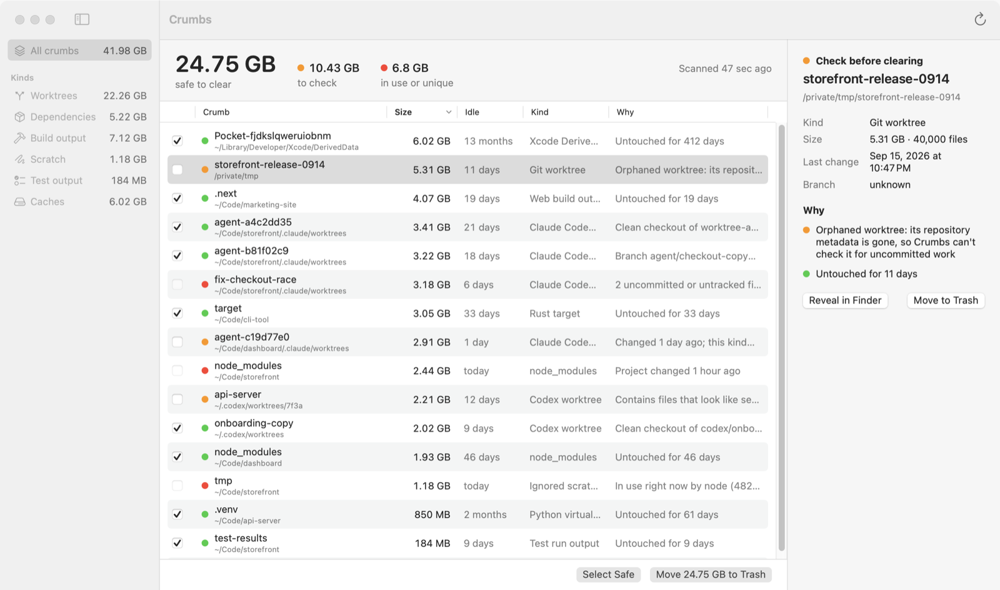

# Crumbs

**Find what your AI agents left behind.**

[Website](https://www.nilni.com/crumbs) · [Download](https://github.com/nilveryboring/crumbs/releases/latest) · [Feedback](https://www.makeform.ai/f/z6g4pJJB) · [Privacy](https://www.nilni.com/crumbs/privacy)



Claude Code, Codex, Cursor and friends make a fresh git worktree for every
task, install `node_modules` in each one, drop scratch files in `tmp/`, and
move on. A few weeks later that is a few hundred gigabytes.

Crumbs is a small native macOS app (about 2 MB) that finds those leftovers
and tells you, for each one, whether it is actually safe to throw away and why.

## Install

Download `Crumbs-<version>.zip` from the
[latest release](https://github.com/nilveryboring/crumbs/releases/latest), unzip
it, and drag Crumbs to Applications. Requires macOS 14 or later, Apple silicon
or Intel.

Builds are signed with a Developer ID and notarized by Apple, so it opens like
any other app.

Crumbs makes no network requests and collects nothing. See the
[privacy policy](https://www.nilni.com/crumbs/privacy).

## The point is the "why"

Deleting folders is easy. Knowing which ones hold something you still need is
not. Before calling anything safe, Crumbs checks:

| Check | Verdict if it fails |
|---|---|
| A running process (shell, dev server, agent) has its working directory inside | Keep |
| Worktree has uncommitted or untracked files | Keep |
| Detached worktree has commits no branch or remote has | Keep |
| Changed in the last 24 hours | Keep |
| Worktree's repository metadata is gone, so it can't be checked | Check |
| Contains secret-looking files (`.env`, `*secrets*.json`, keys) that are untracked and differ from the main checkout's copy | Check |
| Idle for less than the rule's waiting period | Check |

A branch with unmerged commits is not a blocker: trashing a worktree removes
the checkout, and the branch stays in the repository.

And then:

- **Nothing is deleted.** Everything goes to the Trash, so you can put it back.
- **It checks again right before trashing.** If an agent started working in a
  folder since the scan, that folder is skipped.
- **It cleans up after git.** After a worktree goes to the Trash, Crumbs runs
  `git worktree prune` so the repository forgets it.
- **It never takes git locks** (`GIT_OPTIONAL_LOCKS=0`), so it can't collide
  with an agent that is committing at the same moment.

## What it finds

| Rule | Where |
|---|---|
| Claude Code worktrees | `**/.claude/worktrees/*` |
| Codex worktrees | `~/.codex/worktrees/*`, `~/.codex/worktrees/*/*` |
| Any other linked git worktree | anywhere under the scanned folders, e.g. `/private/tmp` |
| `node_modules` | anywhere, judged by how long ago the project last changed |
| Web build output | ignored `dist`, `.next`, `.nuxt`, `.svelte-kit`, `.astro`, `.turbo`, … |
| Rust `target`, SwiftPM `.build` | next to `Cargo.toml` / `Package.swift` |
| Python virtualenvs | ignored `.venv`, `venv` |
| Scratch folders | ignored `tmp`, `.tmp`, `temp` |
| Test output | ignored `test-results`, `playwright-report`, `coverage` |
| Xcode DerivedData | `~/Library/Developer/Xcode/DerivedData/*` |

"Ignored" means git says the folder is ignored. A committed `build/` folder is
not a crumb.

Sizes count what actually comes back when a folder goes: files hard-linked from
outside it, such as a pnpm store, are not counted.

### Adding a rule

Rules are JSON files in [`Sources/CrumbsCore/Rules`](Sources/CrumbsCore/Rules).
Adding one is a data-only pull request:

```json
{
  "id": "gradle-build",
  "name": "Gradle build",
  "category": "build",
  "description": "Gradle build output. The next build recreates it.",
  "patterns": ["**/build"],
  "requiresSibling": "build.gradle.kts",
  "requiresGitIgnored": true,
  "regenerable": true,
  "activity": "parent",
  "minIdleDays": 14
}
```

`activity: "parent"` measures idle time from the owning project instead of from
the folder itself, which is what you want for dependencies and build output.

## Command line

The package also builds a read-only `crumbs` CLI:

```sh
swift run -c release crumbs scan            # your usual folders
swift run -c release crumbs scan ~/Code     # just this one
swift run -c release crumbs scan --json     # for scripts and agents
```

Every rule's waiting period can be changed, or the rule switched off: in the
app under **Settings → Rules** (the list re-judges instantly, no rescan), or on
the command line:

```sh
crumbs scan --rules                                  # ids and defaults
crumbs scan --days node-modules=60 --days claude-code-worktree=7 --off rust-target
```

The CLI only reports. Trashing happens in the app.

## Building

Requires macOS 14 and Xcode 16 or later.

```sh
swift test                      # core + fixtures with real git worktrees
brew install xcodegen
xcodegen generate
open Crumbs.xcodeproj
```

`scripts/make-icon.sh` re-renders the app icon from `App/CookieArt.swift`.
`scripts/release.sh` builds a Developer ID signed, notarized release zip using
the Apple account signed into Xcode (`--unsigned` for an ad-hoc build).

Crumbs is not sandboxed and is not on the Mac App Store: a sandboxed app can't
walk your code folders or ask git about them.

## Feedback

Found a verdict that looks wrong, or a leftover Crumbs misses? Use
**Help → Send Feedback…** in the app, the
[feedback form](https://www.makeform.ai/f/z6g4pJJB) (built with
[Makeform](https://www.makeform.ai/?ref=crumbs)), or open an issue.

## License

MIT
